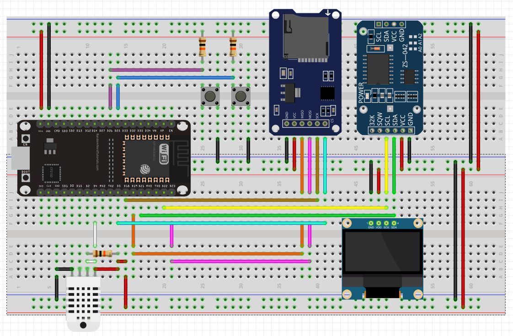

# SENDING ESP32 DATA USING MQTT TO A SERVER WITH RASPBERRY PI (UNDER CONSTRUCTION)

## Description

In this repo I present the steps to set up the MQTT Mosquitto broker in the Raspberry Pi aimed to receive sensor readings from an ESP32 and then save it in a PostgreSQL database.

## Requirements and Modifications to Test This Repo

1- ESP32 WROOM developer board (DOIT ESP32 DEVKIT V1)

2- Raspberry Pi (3 B+)

3- A .env file should be included on the server side to store sensitive information used to grant application access.

4- Use Python scripts to subscribe to the published topic and insert data into the PostgreSQL database.

## ESP32 Circuit Setup Used in this Project

The complete circuit is composed by following components and modules:

- DOIT ESP32 DEVKIT V1
- DHT22
- SD Card Module
- Oled Display SSD1306
- Real Time Clock Module (RTC DS3231)
- 2 Push Buttons
- 3 10 kohm resistors

The circuit setup is shown below:

### Circuit Functionality

This circuit monitors the DHT22 sensor readings at intervals, adjusted directly in the firmware. The DHT22 readings are logged into an SD Card accompanying some other parameters like the RTC date and time, localization of installation, etc. The same data logged into the SD Card is sent using the MQTT protocol to the Raspberry Pi, which saves the data into a Postgres database.

The project was developed using **Arduino IDE 2.3.4** and all sketches are found in **arduino** directory.

## Installing and setting up a Postgres server on Raspberry Pi to create the Database to store the Data from ESP32

