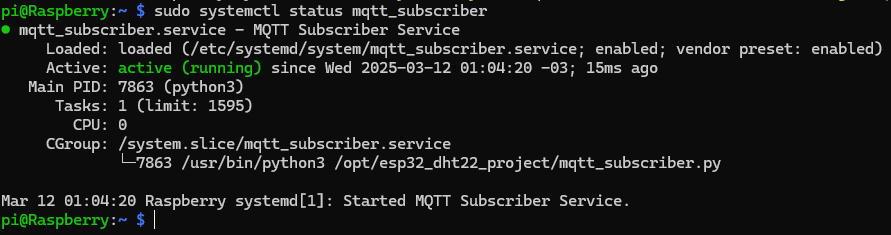

# SENDING ESP32 DATA USING MQTT TO A SERVER WITH RASPBERRY PI (UNDER CONSTRUCTION)

## Description

In this repo I present the steps to set up the MQTT Mosquitto broker in the Raspberry Pi aimed to receive sensor readings from an ESP32 and then save it in a PostgreSQL database.

## Requirements to Test This Repo

1- ESP32 WROOM developer board (DOIT ESP32 DEVKIT V1)

2- Raspberry Pi (3 B+)

3- A .env file should be included on the server side to store sensitive information used to grant application access.

4- Use Python script as Linux service to subscribe to the MQTT topic and insert data into the PostgreSQL database.

## ESP32 Circuit Setup Used in this Project

The complete circuit is composed by the following components and modules:

- DOIT ESP32 DEVKIT V1
- DHT22
- SD Card Module
- Oled Display SSD1306
- Real Time Clock Module (RTC DS3231)
- 2 Push Buttons
- 3 10 kohm resistors

The circuit setup is shown below:


### Circuit Functionality

This circuit monitors the DHT22 sensor readings at intervals, adjusted directly in the firmware. The DHT22 readings are logged into an SD Card accompanying some other parameters like the RTC date and time, localization of installation, etc. The same data logged into the SD Card is sent using the MQTT protocol to the Raspberry Pi, which saves the data into a Postgres database.

The project was developed using **Arduino IDE 2.3.4** and all sketches are found in **arduino** directory.

For convenience it was used an **ssh** connection with Raspberry Pi ([how to set up an ssh connection in Raspberry Pi](https://github.com/vgmariucci/Setting_Up_LAMP_Server_With_Raspberry_Pi)).

## Installing and setting up a Postgres server on Raspberry Pi to create the Database to store the Data from ESP32

After connecting with Raspberry Pi, the first thing to do is installing the PostgreSQL server. Use the following bash commands to do that:

```bash
sudo apt update
```
```bash
sudo apt install postgresql postgresql-contrib
```
```bash
sudo systemctl start postgresql
```
```bash
sudo systemctl enable postgresql
```

### Create Database and User

1- Switch to the postgres user:

```bash
sudo -i -u postgres
```
2- Create a database and user:

```bash
createdb iot_database
```
If you need to exclude the database for some reason (for instance a typo in the name) use the following command:

```bash
dropdb iot_database
```
3- Create a SUPERUSER
```bash
psql -c "CREATE USER iot_admin WITH PASSWORD 'your_admin_password';"
```
```bash
psql -c "ALTER USER iot_admin WITH SUPERUSER;"
```
4- To chek if the database was created (or dropped) use the commands below:

Access the Postgres bash manager

```bash
psql
```
Command to list the databases:

```sql
\l
```

### Create Table for Sensor Data

1- Connect to the database:

```bash
psql -d iot_database
```

2- Create a table:

```sql
CREATE TABLE sensor_readings (
    id SERIAL PRIMARY KEY,
    reading_time TIMESTAMPTZ NOT NULL,
    customer_ID TEXT NOT NULL,
    iot_device_serial_number TEXT NOT NULL,
    temperature NUMERIC(5,2),
    humidity NUMERIC(5,2),
    wifi_status INTEGER
);
```

3- Verify the created table:

Using psql Meta-Command (Recommended):

```sql
\dt
```


4- Exit PostgreSQL

```sql
\q
```

5- Test Manually

```sql
INSERT INTO sensor_readings 
(reading_time, customer_ID, iot_device_serial_number, temperature, humidity, wifi_status)
VALUES (NOW(), 'test_customer', 'esp32_001', 25.5, 60.0, 1);
```

## Install Python Dependencies

```bash
sudo apt install python3 python3-pip
```
```bash
pip3 install paho-mqtt psycopg2-binary python-dotenv
```

##  Setting Up MQTT Broker

1- Install Mosquitto (MQTT Broker)

```bash
sudo apt update
```
```bash
sudo apt install mosquitto mosquitto-clients
```

2- Configure Mosquitto for Non-TLS

Edit the Mosquitto configuration:

```bash
sudo nano /etc/mosquitto/conf.d/default.conf
```
Add these lines to enable authentication on port 1883:

```ini
listener 1883
allow_anonymous false
password_file /etc/mosquitto/passwd
```
3- Create Password File:

```bash
sudo mosquitto_passwd -c /etc/mosquitto/passwd mqtt_user
```
Enter your password when prompted (e.g., mqtt_password).

4- Restart Mosquitto

```bash
sudo systemctl restart mosquitto
```

5- Install and Enable Uncomplicated Firewall (UFW)

```bash
sudo apt-get install ufw
```

```bash
sudo ufw enable
```

6- Allow Port 1883 in Firewall

```bash
sudo ufw allow 1883
```
```bash
sudo ufw reload
```

### Test MQTT Broker Locally

1- Subscribe to a Topic

```bash
mosquitto_sub -h localhost -p 1883 -u mqtt_user -P mqtt_password -t "sensor/data" -v
```

2- Publish a Test Message (New Terminal)

```bash
mosquitto_pub -h localhost -p 1883 -u mqtt_user -P mqtt_password -t "sensor/data" -m "hello"
```
If successful, you’ll see hello in the subscriber terminal.


## Testing the Python script mqtt_subscriber.py 

### Organizing the Files

1- Create a folder in /opt path and name it according with your project. We'll use this folder to store the **mqtt_subscriber.py** script and **.env** file:

```bash
sudo mkdir /opt/esp32_dht22_project

```
2- Chek if the folder was created:

```bash
ls -la /opt/
```


3- You can acces the project's folder or just pass the correct folder path from the directory you are to create a copy of the script **mqtt_subscriber.py** and **.env** from Python folder to a dedicated directory, as shown bellow:

- Accessing the project's folder

```bash
cd /opt/esp32_dht22_project
```
- Creating the **mqtt_subscriber.py** script

```bash
sudo nano mqtt_subscriber.py
```


- Creating the **.env** script

```bash
sudo nano .env
```
Use the .env_example template to set your .env file for your project.

4- Test the **mqtt_subscriber.py**:

```bash
python3 mqtt_subscriber.py
```


5- Check the tabe in Postgres iot_database:

- Access the **iot_database**
```bash
sudo -u postgres psql -d iot_database
```


- Select the last 10 rows in **sensor_readings** table

```sql
SELECT * FROM sensor_readings ORDER BY reading_time DESC LIMIT 10;
```


## Setting the mqtt_subscriber.py as a Linux service

To create a service to keep running the mqtt_subscriber.py you must follow the steps below:

1- Create a new systemd service file:

```bash
sudo nano /etc/systemd/system/mqtt_subscriber.service
```

2- Add the following content (adjust paths as needed):

```ini
[Unit]
Description=MQTT Subscriber Service
After=network.target

[Service]
User=www-data
Group=www-data
WorkingDirectory=/opt/esp32_dht22_project/
ExecStart=/usr/bin/python3 /opt/esp32_dht22_project/mqtt_subscriber.py
Restart=always
RestartSec=10
EnvironmentFile=/opt/esp32_dht22_project/.env

[Install]
WantedBy=multi-user.target
```


3- Set permissions:

```bash
sudo chown -R www-data:www-data /opt/esp32_dht22_project
```

```bash
sudo chmod 755 /opt/esp32_dht22_project/mqtt_subscriber.py
```

4- Enable and Start the Service

- Reload systemd to recognize the new service:

    ```bash
    sudo systemctl daemon-reload
    ```
- Start the service:

    ```bash
    sudo systemctl start mqtt_subscriber
    ```
- Enable it to start on boot:

    ```bash
    sudo systemctl enable mqtt_subscriber
    ```


After the commands above, you'll see the message highlighted on the print.

5-  Verify the Service

- Check the status:

    ```bash
    sudo systemctl status mqtt_subscriber
    ```

    If everything goes ok, you'll see the output status message with the *active (running)* message:

    

- View logs:

    ```bash
    sudo journalctl -u mqtt_subscriber -f
    ```

6- Bug-fix for the paho-mqtt package

The **mqtt_subscriber** service may throw a **ModuleNotFoundError: No module named 'paho'** error because it cannot find or access the paho-mqtt package. To fix this we can try: 

-   Install it globally using **pip3** (considering Python 3):

    ```bash
    sudo pip3 install paho-mqtt
    ```
-   Verify installation

    ```bash
    pip3 show paho-mqtt
    ```
-   Reload systemd and restart the service

    ```bash
    sudo systemctl daemon-reload
    ```
    ```bash
    sudo systemctl restart mqtt_subscriber.service
    ```
-   Check service status/logs

    ```bash
    sudo systemctl status mqtt_subscriber.service
    ```
    

